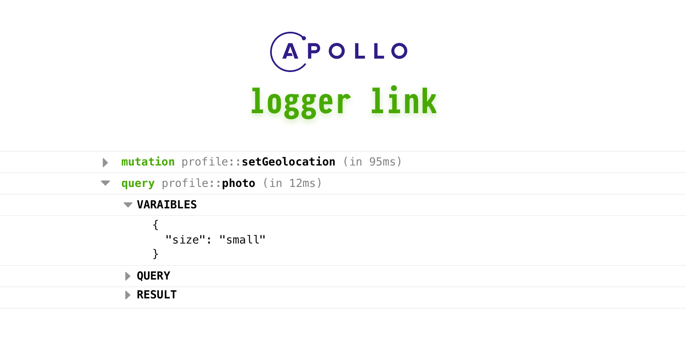

Simple yet powerfull logger link for your apollo client.

### Usage

```ts
import { ApolloLink } from 'apollo-link'
import { ApolloClient } from 'apollo-client'
import { loggerLink } from 'apollo-logger-link'
import { InMemoryCache } from 'apollo-cache-inmemory'

const logger = loggerLink(op => op.getContext().schemaName)

const apolloClient = new ApolloClient({
  link: ApolloLink.from([logger, new HttpLink({ uri: '/graphql' })]),
  cache: new InMemoryCache()
})
```
